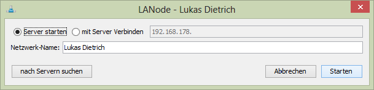
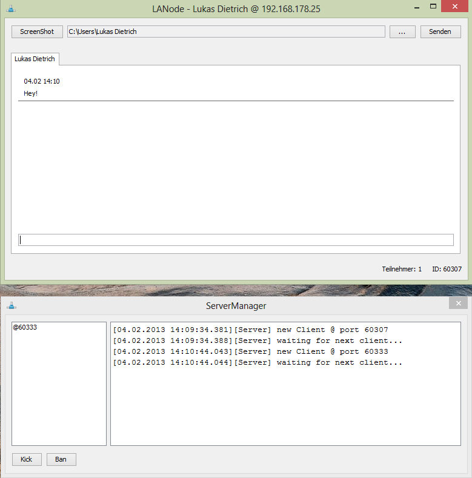

#LANode

> **LANode** as in *LAN* for Local Area Network and *Node* as in Networkpart is a basic server-client system
> to easily share files, screenshots and simple text through the local network!
> The UI is simple and lets you easily create a local server for instant usage.
> You could also upload LANode to a server and run it there, the only difference in usage is the IP!

##Configuration & Usage

Local Networks shouldn't be a problem in any way. Just make sure, that your router is able to let the
connected devices communicate with eachother.

As a client or server you need to have JAVA installed! Version 6 should work fine, if you are not ages behind
everything should work like expected.
As a server you also need to open port **25569** !
Maybe your firewall is blocking it, if you are confronted with any problems.
Also by default all routers block ports from outer LAN, therefor for a WWW connection you would need to forward that port!

If you are using the program the *simple mode*, the only thing to mention is: start and click on your desired option!

If you are using the program for a real server environment (like on a linux vps or whatever) you can also use the same JAR
without a client launched.

To achieve a server-only version just run LANode through the commandline!
	
	java -jar path/to/jar/LANode.jar nogui

##Troubleshooting

**A file can't be sent**
> Java uses a defined size of RAM. If your file is larger, than the allocated RAM, an error is thrown.
> < 50MB shouldn't be a problem, anything above would force you to start LANode with more RAM manually.
  
  
  
---
  
  
  
##Screenshots

